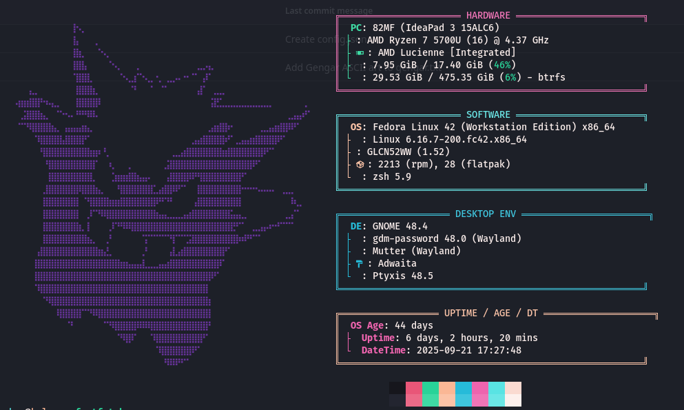

# fastfetch config

minimal system info display with gengar ascii art




## features

- gengar pokemon ascii art logo
- organized sections: hardware, software, desktop, uptime
- 9-bit style borders with color coding
- nerd font icons
- system age calculation
- color palette display

## installation

```bash
sudo dnf install fastfetch  

wget https://github.com/ryanoasis/nerd-fonts/releases/download/v3.0.2/FiraCode.zip
unzip FiraCode.zip -d ~/.local/share/fonts/
fc-cache -fv
```

## usage

```bash
mkdir -p ~/.config/fastfetch
cp config.jsonc ~/.config/fastfetch/

fastfetch
```

## customization

edit the config file to change:
- logo colors (modify hex values in logo section)
- sections visibility (comment/uncomment modules)
- color scheme (change keyColor values)
- icons (replace with other nerd font symbols)


---

*pokeeeemon*
